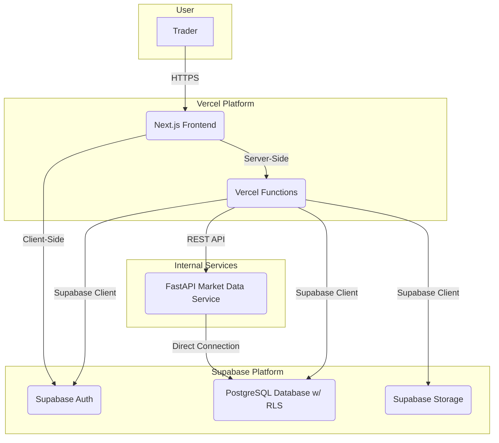
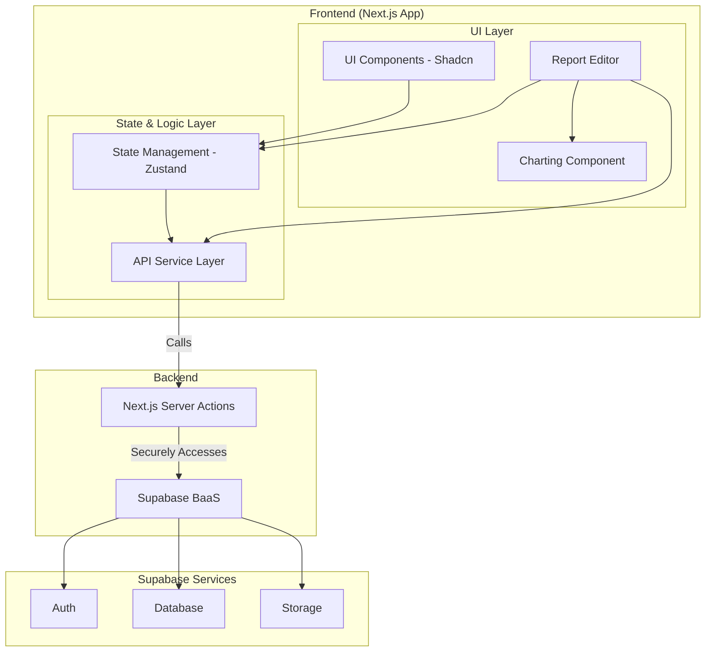
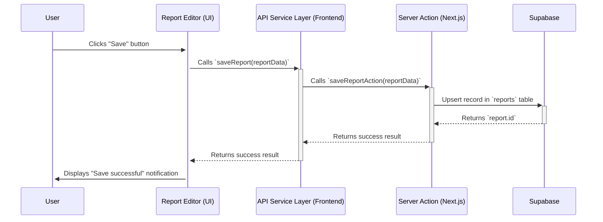

# AI-Powered Trading Support System - Fullstack Architecture Document

| Date | Version | Description | Author |
| :--- | :--- | :--- | :--- |
| 2025-08-02 | 2.0 | Added final sections on Security, Performance, and Standards. Doc complete. | Winston (Architect) |
| 2025-08-02 | 1.9 | Added Deployment & CI/CD Architecture section. | Winston (Architect) |
| 2025-08-02 | 1.8 | Added Development Workflow section. | Winston (Architect) |
| 2025-08-02 | 1.7 | Added Unified Project Structure section. | Winston (Architect) |
| 2025-08-02 | 1.6 | Added Backend Architecture section. | Winston (Architect) |
| 2025-08-02 | 1.5 | Refined Frontend Architecture based on existing structure. | Winston (Architect) |
| 2025-08-02 | 1.4 | Added External APIs section and klinecharts research. | Winston (Architect) |
| 2025-08-02 | 1.3 | Updated Charting Component dependency. | Winston (Architect) |
| 2025-08-02 | 1.2 | Added initial content up to Data Models. | Winston (Architect) |
| 2025-08-02 | 1.1 | Updated to reflect the hybrid-brownfield model. | Winston (Architect) |
| 2025-08-02 | 1.0 | Initial architecture draft | Winston (Architect) |

---

## 1. Introduction

This document outlines the complete fullstack architecture for the **AI-Powered Trading Support System**, including backend systems, frontend implementation, and their integration. It serves as the single source of truth for AI-driven development, ensuring consistency across the entire technology stack.

This unified approach combines what would traditionally be separate backend and frontend architecture documents, streamlining the development process for modern fullstack applications where these concerns are increasingly intertwined.

### 1.1. Starter Template or Existing Project

This project adopts a **hybrid-brownfield** approach:

*   **Frontend (Brownfield):** The user interface is built upon an **existing** foundation using Next.js, Shadcn-ui, and Tailwind CSS. This provides an established design system and UI development patterns.
*   **Backend (Greenfield Hybrid):** The backend is being built **from scratch** following a hybrid model:
    *   **BaaS (Backend-as-a-Service):** For core CRUD (Create, Read, Update, Delete) operations and authentication, the system will leverage **Supabase** to accelerate development and time-to-market.
    *   **Microservices:** For complex processing tasks or specialized business requirements in the future, separate APIs will be developed using **FastAPI (Python)**.

This approach allows for rapid launch by using managed services (Supabase) for common needs while retaining the flexibility to build custom, high-performance services as required.

---

## 2. High Level Architecture

### 2.1. Technical Summary

This architecture utilizes a **Jamstack** approach for the frontend and a **hybrid Backend-as-a-Service (BaaS)** model for the backend. The frontend is a Next.js application featuring Server-Side Rendering (SSR) and Static Site Generation (SSG), hosted on Vercel for optimal performance and global scalability. The backend leverages **Supabase** for its PostgreSQL database, authentication, and file storage, while reserving the capability to integrate **FastAPI** services in the future for specialized tasks. The primary integration point is through the Supabase client library within the Next.js application, enabling secure, direct communication from Next.js's server-side to Supabase, underpinned by Row Level Security (RLS) to ensure data isolation.

### 2.2. Platform and Infrastructure Choice

Based on the PRD requirements and our discussions, the chosen platform is a combination of **Vercel and Supabase**.

*   **Platform:** Vercel (for Frontend) and Supabase (for Backend)
*   **Key Services:**
    *   **Vercel:** Next.js Hosting, Vercel Functions (for lightweight server-side logic), Global CDN.
    *   **Supabase:** PostgreSQL Database, Supabase Auth, Supabase Storage (for chart drawings, images), Row Level Security (RLS).
*   **Deployment Host and Regions:**
    *   **Vercel:** Global (Edge Network).
    *   **Supabase:** To be configured in a region close to the target user base (e.g., `ap-southeast-1` - Singapore).

### 2.3. Repository Structure

A **monorepo** structure managed by **pnpm workspaces** will be used. This approach is well-suited for Next.js applications and allows for efficient code sharing (e.g., TypeScript type definitions).

*   **Structure:** Monorepo
*   **Monorepo Tool:** pnpm workspaces (based on the existing `pnpm-lock.yaml`)
*   **Package Organization:**
    *   `frontend/`: Contains the main Next.js application.
    *   `packages/shared-types`: A shared package for TypeScript definitions used by both the frontend and potentially future backend services.

### 2.4. High Level Architecture Diagram



### 2.5. Architectural Patterns

*   **Jamstack:** Utilizes pre-rendered pages and reusable APIs to deliver higher performance and security.
    *   *Rationale:* Leverages the full strengths of Next.js and Vercel.
*   **Backend as a Service (BaaS):** Leverages Supabase to quickly implement complex backend functionalities.
    *   *Rationale:* Significantly reduces development time for the MVP.
*   **Component-Based UI:** Builds the UI from reusable React components with TypeScript.
    *   *Rationale:* Already established by the Shadcn-ui foundation, ensuring consistency and maintainability.
*   **API Layer Abstraction:** Creates a service layer within the Next.js app to abstract calls to Supabase.
    *   *Rationale:* Facilitates easier migration to future FastAPI services without rewriting logic in multiple places.

---

## 3. Tech Stack

The table below is the single source of truth for the technologies selected for this project. All development must adhere to these exact technologies and versions.

| Category | Technology | Version | Purpose | Rationale |
| :--- | :--- | :--- | :--- | :--- |
| **Frontend Language** | TypeScript | ~5.x | Primary language for the Next.js app | Established in the project, provides type safety. |
| **Frontend Framework** | Next.js | 14.x | React framework for the web application | Core requirement from PRD, provides SSR, SSG, and high performance. |
| **UI Library** | Shadcn-ui | Latest | Building UI components | Established, provides beautiful, accessible, and customizable components. |
| **State Management** | Zustand | Latest | Global application state management | Lightweight, simple, and scalable. Suitable for more complex state than React Context. |
| **Backend Language** | SQL, Python | 15, 3.11+ | Language for DB (Supabase) and custom services | SQL is standard for PostgreSQL. Python/FastAPI chosen for future complex services. |
| **Backend Framework** | Supabase (BaaS) | Latest | Provides DB, Auth, Storage for MVP | Accelerates MVP development as per PRD. |
| **API Style** | REST & Realtime | v1 | Communication between frontend and backend | Supabase provides both, allowing for data queries and real-time updates. |
| **Database** | PostgreSQL | 15.x | Primary data storage for the application | Robust, reliable database provided by Supabase. |
| **Cache** | N/A for MVP | - | Speeding up data queries | Not required for MVP. Can integrate Redis in the future. |
| **File Storage** | Supabase Storage | Latest | Storing chart drawings, images | Natively integrated with Supabase, easy to use and manage permissions. |
| **Authentication** | Supabase Auth | Latest | User and session management | Core requirement from PRD, deeply integrated with PostgreSQL RLS. |
| **Frontend Testing** | Jest, RTL | Latest | Unit and integration testing for React components | Industry standard for React/Next.js applications. |
| **Backend Testing** | pgTAP, Pytest | Latest | Testing DB logic and API services | pgTAP for testing functions and RLS in Postgres. Pytest for FastAPI services. |
| **E2E Testing** | Playwright | Latest | End-to-end user flow testing | Provides a modern, robust solution for automating real user scenarios. |
| **Build Tool** | Vercel CLI / Next.js CLI | 14.x | Building and deploying the application | Default and optimized tools for the Next.js/Vercel ecosystem. |
| **Bundler** | Webpack | 5.x | Bundling assets for the frontend | Integrated and managed by Next.js. |
| **IaC Tool** | N/A for MVP | - | Managing infrastructure as code | Not necessary when using managed services like Vercel/Supabase. |
| **CI/CD** | GitHub Actions | - | Automating build, test, deploy pipeline | `.github` directory already exists, making it a natural choice. |
| **Monitoring** | Vercel Analytics & Sentry | Latest | Tracking application performance and errors | Vercel Analytics for Core Web Vitals. Sentry for proactive error tracking. |
| **Logging** | Vercel Logs | - | Capturing application and function logs | Natively integrated with the Vercel platform. |
| **CSS Framework** | Tailwind CSS | 3.x | Styling UI components | Established in the project, allows for rapid and consistent styling. |

---

## 4. Data Models

This section defines the core data models/entities that will be shared between the frontend and backend.

### 4.1. Model: `Asset`
*   **Purpose:** Represents a financial instrument a user can analyze.
*   **Attributes:**
    *   `id`: `uuid` - Primary key.
    *   `user_id`: `uuid` - Foreign key to the user.
    *   `symbol`: `text` - Unique trading symbol per user (e.g., "EURUSD").
    *   `name`: `text` - Full name of the asset (e.g., "Euro / US Dollar").
    *   `description`: `text` - Optional description.
    *   `created_at`: `timestamp` - Creation timestamp.
*   **Constraint:** `(user_id, symbol)` must be unique.

```typescript
// packages/shared-types/src/asset.ts
export interface Asset {
  id: string;
  user_id: string;
  symbol: string; // Unique per user
  name: string;
  description?: string;
  created_at: string;
}
```

### 4.2. Model: `Methodology`
*   **Purpose:** Represents a user-defined analysis strategy.
*   **Attributes:**
    *   `id`: `uuid` - Primary key.
    *   `user_id`: `uuid` - Foreign key to the user.
    *   `name`: `text` - Name of the methodology (e.g., "ICT").
    *   `description`: `text` - Optional description.
    *   `created_at`: `timestamp` - Creation timestamp.

```typescript
// packages/shared-types/src/methodology.ts
export interface Methodology {
  id: string; // uuid
  user_id: string; // uuid
  name: string;
  description?: string;
  created_at: string; // timestamp
}
```

### 4.3. Model: `Report`
*   **Purpose:** Acts as a container for a complete analysis.
*   **Attributes:**
    *   `id`: `uuid` - Primary key.
    *   `user_id`: `uuid` - Foreign key to the user.
    *   `asset_id`: `uuid` - Foreign key to the `Asset`.
    *   `methodology_id`: `uuid` - Foreign key to the `Methodology`.
    *   `title`: `text` - Title of the report.
    *   `status`: `text` - Status (e.g., 'draft', 'published').
    *   `created_at`: `timestamp` - Creation timestamp.
    *   `updated_at`: `timestamp` - Last update timestamp.

```typescript
// packages/shared-types/src/report.ts
export interface Report {
  id: string; // uuid
  user_id: string; // uuid
  asset_id: string; // uuid
  methodology_id: string; // uuid
  title: string;
  status: 'draft' | 'published';
  created_at: string; // timestamp
  updated_at: string; // timestamp
}
```

### 4.4. Model: `AnalysisBlock`
*   **Purpose:** Represents a single unit of analysis within a report.
*   **Attributes:**
    *   `id`: `uuid` - Primary key.
    *   `report_id`: `uuid` - Foreign key to the `Report`.
    *   `user_id`: `uuid` - Foreign key to the user (for RLS simplification).
    *   `timeframe`: `text` - Chart timeframe (e.g., 'H4', 'D1').
    *   `is_primary`: `boolean` - Marks if this is the primary analysis timeframe.
    *   `bias`: `text` - Bias of the analysis ('bullish', 'bearish', 'neutral').
    *   `chart_data`: `jsonb` - Data for chart drawings.
    *   `notes`: `text` - User's text notes.
    *   `snapshot_image_url`: `text` - Optional URL to a screenshot of the analysis.
    *   `created_at`: `timestamp` - Creation timestamp.

```typescript
// packages/shared-types/src/analysis.ts
export interface ChartDrawing {
  id: string;
  type: 'trendline' | 'rectangle';
  points: { x: number; y: number }[];
}

export interface AnalysisBlock {
  id: string;
  report_id: string;
  user_id: string;
  timeframe: string;
  is_primary: boolean;
  bias: 'bullish' | 'bearish' | 'neutral';
  chart_data: ChartDrawing[];
  notes: string;
  snapshot_image_url?: string;
  created_at: string;
}
```

### 4.5. Model: `TradeEntry`
*   **Purpose:** Records the details of an actual trade executed based on a report.
*   **Attributes:**
    *   `id`: `uuid` - Primary key.
    *   `report_id`: `uuid` - Foreign key (1-to-1 relationship) to the `Report`.
    *   `user_id`: `uuid` - Foreign key to the user.
    *   `order_type`: `text` - Order type ('market' or 'limit').
    *   `entry_pattern`: `text` - Entry pattern/model (e.g., "Engulfing candle").
    *   `entry_price`: `numeric` - Entry price.
    *   `stop_loss`: `numeric` - Stop loss price.
    *   `take_profit_1`: `numeric` - Take profit target 1.
    *   `take_profit_2`: `numeric` - Optional take profit target 2.
    *   `take_profit_3`: `numeric` - Optional take profit target 3.
    *   `trade_type`: `text` - Trade type ('long' or 'short').
    *   `outcome`: `text` - Outcome ('win', 'loss', 'breakeven', 'running').
    *   `executed_at`: `timestamp` - Execution timestamp.
    *   `closed_at`: `timestamp` - Optional closing timestamp.
    *   `entry_image_url`: `text` - Optional URL to a screenshot of the entry.

```typescript
// packages/shared-types/src/trade.ts
export interface TradeEntry {
  id: string;
  report_id: string;
  user_id: string;
  order_type: 'market' | 'limit';
  entry_pattern: string;
  entry_price: number;
  stop_loss: number;
  take_profit_1: number;
  take_profit_2?: number;
  take_profit_3?: number;
  trade_type: 'long' | 'short';
  outcome: 'win' | 'loss' | 'breakeven' | 'running';
  executed_at: string; // timestamp
  closed_at?: string; // timestamp
  entry_image_url?: string;
}
```

---

## 5. API Specification

Because we are using Supabase as the primary backend for the MVP, we do not need to define a traditional REST or GraphQL API specification. Instead, our "API" is the set of tables, views, and functions within our PostgreSQL database, accessed via the Supabase client library.

Security and business logic will be enforced at two levels:

1.  **Row Level Security (RLS) in PostgreSQL:** This is the first and most critical line of defense. RLS policies will ensure that users can only access (read, write, update, delete) their own data.
2.  **Service Layer in Next.js:** All interactions with Supabase will be encapsulated within server-side functions in the Next.js application. This abstraction layer will contain additional business logic and prevent Supabase details from being exposed to the client-side.

#### Example Query Flow:

1.  A React component (client-side) needs to display a list of reports.
2.  It calls a Server Action in Next.js named `getReports()`.
3.  The `getReports()` function (running on the server) initializes the Supabase client with the logged-in user's credentials.
4.  It executes a query against the `reports` table.
5.  PostgreSQL applies the RLS policies, returning only the rows where the `user_id` matches the current user's ID.
6.  The `getReports()` function returns the secure data to the React component for display.

---

## 6. Components

This section defines the main logical components that make up the system.

### 6.1. Component List

##### Component 1: API Service Layer (Frontend)
*   **Responsibility:** Provide a single, consistent interface for all data operations (CRUD). This layer abstracts the specific implementation (e.g., calling Server Actions), so UI components don't need to know how data is fetched or sent.
*   **Key Interfaces:** `reportService.ts` (with functions like `getReports`, `createReport`), `assetService.ts`, etc.
*   **Dependencies:** Next.js Server Actions.
*   **Tech Stack:** TypeScript.

##### Component 2: Report Editor (Frontend)
*   **Responsibility:** Provide the interactive workspace for creating and editing reports. Manages the state of analysis blocks, integrates with the charting library, and orchestrates saving data for the `Report`, `AnalysisBlock`, and `TradeEntry` models.
*   **Key Interfaces:** Event handlers like `handleSaveReport`, `handleAddBlock`, `handleDrawingComplete`.
*   **Dependencies:** API Service Layer, Charting Component, State Management (Zustand).
*   **Tech Stack:** React, TypeScript, Zustand, Charting Library.

##### Component 3: Charting Component (Frontend)
*   **Responsibility:** Wrap the **klinecharts** library. Handles rendering candle data, providing drawing tools, and exporting/importing the state of drawn objects (`chart_data`).
*   **Key Interfaces:** Props to receive data and callbacks to notify of changes (e.g., `onDrawingsChange`).
*   **Dependencies:** **klinecharts**
*   **Tech Stack:** React, TypeScript.

##### Component 4: Database Service (Backend/Supabase)
*   **Responsibility:** Store, manage, and secure all application data. Enforce data integrity and security through constraints and Row Level Security policies.
*   **Key Interfaces:** SQL Interface, Supabase Client API.
*   **Dependencies:** None (it is the foundation).
*   **Tech Stack:** PostgreSQL, SQL, PL/pgSQL.

### 6.2. Component Diagrams

This diagram illustrates the relationships between the main logical components.



---

## 7. External APIs

This section identifies the internal FastAPI service that our application will build and integrate with.

### 7.1. API: Internal Market Data Service
*   **Purpose:** To provide historical and (eventually) real-time price (candlestick) data for financial assets. This service is a core component of our backend, built with FastAPI.
*   **Source Code:** `backend/` directory in the monorepo.
*   **Deployment:** Will be deployed as a serverless function (e.g., on Vercel, AWS Lambda).
*   **Authentication:** The service will be protected and only accessible from our Next.js frontend's server-side.
*   **Key Endpoints to be Built:**
    *   `GET /api/v1/candles`: To fetch historical candlestick data for a given asset, timeframe, and date range.
        *   Query Parameters: `symbol`, `resolution`, `from`, `to`.
        *   Response: A JSON object compatible with the `klinecharts` library.
*   **Data Source:** The FastAPI service itself will connect to our primary PostgreSQL database to fetch and process data. (Note: This implies we also need a way to get market data *into* our database, which will require a separate data ingestion script/process).

## 8. Core Workflows

This section illustrates key system processes using sequence diagrams to clarify component interactions.

### 8.1. Workflow: Creating a New Analysis Report

This diagram describes the steps from the user clicking "Save" in the report editor to the data being securely stored in Supabase.



---

## 9. Database Schema

This section translates the defined data models into a concrete SQL database schema for PostgreSQL. The `CREATE TABLE` statements below include necessary data types, foreign keys, and constraints.

```sql
-- User table (managed by Supabase Auth)
-- This table already exists in Supabase's `auth` schema.
-- We will reference it via `auth.users(id)`.

-- Table to store user's trading assets
CREATE TABLE public.assets (
    id uuid PRIMARY KEY DEFAULT gen_random_uuid(),
    user_id uuid NOT NULL REFERENCES auth.users(id) ON DELETE CASCADE,
    symbol TEXT NOT NULL,
    name TEXT NOT NULL,
    description TEXT,
    created_at TIMESTAMPTZ NOT NULL DEFAULT now(),
    UNIQUE(user_id, symbol)
);
-- Enable Row Level Security
ALTER TABLE public.assets ENABLE ROW LEVEL SECURITY;

-- Table to store user's trading methodologies
CREATE TABLE public.methodologies (
    id uuid PRIMARY KEY DEFAULT gen_random_uuid(),
    user_id uuid NOT NULL REFERENCES auth.users(id) ON DELETE CASCADE,
    name TEXT NOT NULL,
    description TEXT,
    created_at TIMESTAMPTZ NOT NULL DEFAULT now()
);
-- Enable Row Level Security
ALTER TABLE public.methodologies ENABLE ROW LEVEL SECURITY;

-- Main table for analysis reports
CREATE TABLE public.reports (
    id uuid PRIMARY KEY DEFAULT gen_random_uuid(),
    user_id uuid NOT NULL REFERENCES auth.users(id) ON DELETE CASCADE,
    asset_id uuid NOT NULL REFERENCES public.assets(id) ON DELETE RESTRICT,
    methodology_id uuid NOT NULL REFERENCES public.methodologies(id) ON DELETE RESTRICT,
    title TEXT NOT NULL,
    status TEXT NOT NULL DEFAULT 'draft', -- 'draft' or 'published'
    created_at TIMESTAMPTZ NOT NULL DEFAULT now(),
    updated_at TIMESTAMPTZ NOT NULL DEFAULT now()
);
-- Enable Row Level Security
ALTER TABLE public.reports ENABLE ROW LEVEL SECURITY;

-- Table for analysis blocks within a report
CREATE TABLE public.analysis_blocks (
    id uuid PRIMARY KEY DEFAULT gen_random_uuid(),
    report_id uuid NOT NULL REFERENCES public.reports(id) ON DELETE CASCADE,
    user_id uuid NOT NULL REFERENCES auth.users(id) ON DELETE CASCADE,
    timeframe TEXT NOT NULL,
    is_primary BOOLEAN NOT NULL DEFAULT false,
    bias TEXT NOT NULL, -- 'bullish', 'bearish', 'neutral'
    chart_data JSONB,
    notes TEXT,
    snapshot_image_url TEXT,
    created_at TIMESTAMPTZ NOT NULL DEFAULT now()
);
-- Enable Row Level Security
ALTER TABLE public.analysis_blocks ENABLE ROW LEVEL SECURITY;

-- Table for trade entries associated with a report
CREATE TABLE public.trade_entries (
    id uuid PRIMARY KEY DEFAULT gen_random_uuid(),
    report_id uuid NOT NULL UNIQUE REFERENCES public.reports(id) ON DELETE CASCADE, -- UNIQUE constraint for 1-to-1 relationship
    user_id uuid NOT NULL REFERENCES auth.users(id) ON DELETE CASCADE,
    order_type TEXT NOT NULL, -- 'market' or 'limit'
    entry_pattern TEXT,
    entry_price NUMERIC NOT NULL,
    stop_loss NUMERIC NOT NULL,
    take_profit_1 NUMERIC,
    take_profit_2 NUMERIC,
    take_profit_3 NUMERIC,
    trade_type TEXT NOT NULL, -- 'long' or 'short'
    outcome TEXT NOT NULL DEFAULT 'running', -- 'win', 'loss', 'breakeven', 'running'
    executed_at TIMESTAMPTZ NOT NULL DEFAULT now(),
    closed_at TIMESTAMPTZ,
    entry_image_url TEXT
);
-- Enable Row Level Security
ALTER TABLE public.trade_entries ENABLE ROW LEVEL SECURITY;
```

---

## 10. Frontend Architecture

This section defines the specific architectural details for the Next.js application, adhering strictly to the established directory structure.

### 10.1. Routing and Component Architecture

We will follow and extend the established pattern.

**1. Route Definition in `app`:**

*   **Report Management:**
    *   Create directory `frontend/src/app/dashboard/reports/`.
    *   Its `page.tsx` will be responsible for fetching the list of reports and then rendering the `ReportListingView` component from `features`.
*   **Report Editor:**
    *   Create directory `frontend/src/app/dashboard/reports/[reportId]/`.
    *   Its `page.tsx` will fetch data for a specific report based on `reportId` and render the `ReportEditorView` component from `features`.
*   **Asset Management:**
    *   Create directory `frontend/src/app/dashboard/assets/`.
    *   Its `page.tsx` will fetch and render the `AssetManagementView` from `features`.
*   **Methodology Management:**
    *   Create directory `frontend/src/app/dashboard/methodologies/`.
    *   Its `page.tsx` will fetch and render the `MethodologyManagementView` from `features`.

**2. Component Organization in `features`:**

*   **`frontend/src/features/reports/`**:
    *   `components/`: Contains child components like `report-data-table.tsx`, `report-editor.tsx`, `analysis-block.tsx`.
    *   `actions/`: Contains related Server Actions (`saveReportAction`, `deleteReportAction`).
    *   `page-views/`: Contains the main "view" components called by the `page.tsx` files in `app`.
        *   `report-listing-view.tsx`
        *   `report-editor-view.tsx`
*   **`frontend/src/features/assets/`**: Will have a similar structure (`components`, `actions`, `page-views`).
*   **`frontend/src/features/methodologies/`**: Will have a similar structure.

### 10.2. State Management Architecture

*   **Local State:** Use React's `useState` and `useReducer` for state confined to a single component.
*   **Global State:** Use **Zustand** for state shared across the application, such as logged-in user information or the complex state of the `Report Editor`.

### 10.3. Routing Architecture

*   **Routing:** Use the **Next.js App Router**. Routes are defined by the directory structure within `frontend/src/app/`.
*   **Protected Routes:** A **Middleware** (`frontend/src/middleware.ts`) will be used to check for user authentication before allowing access to protected pages (e.g., `/dashboard`, `/reports`). Unauthenticated users will be redirected to `/auth/sign-in`.

---

## 11. Backend Architecture

The backend architecture for the MVP is maximally simplified by leveraging **Supabase** as the primary platform.

### 11.1. Service Architecture

*   **Model:** Backend-as-a-Service (BaaS).
*   **Business Logic:**
    1.  **Row Level Security (RLS) Policies:** Core data security and authorization logic is defined directly in the PostgreSQL database. This is a robust and efficient security practice.
        *   **Example:** An RLS policy on the `reports` table would be: `(auth.uid() = user_id)`. This ensures a user can only interact with reports they own.
    2.  **PostgreSQL Functions and Triggers:** More complex logic, such as automatically updating the `updated_at` field whenever a report is modified, can be handled by PostgreSQL trigger functions.
    3.  **Next.js Server Actions:** Business logic that cannot be expressed in SQL (e.g., calling an external API like the market data API) will be placed in Server Actions.

### 11.2. Database Architecture

*   **Schema:** Defined in detail in Section 9.
*   **Data Access Layer:**
    *   There is no traditional DAL (like an ORM) on the backend.
    *   Instead, the **Supabase Client Library**, called from within Next.js Server Actions, acts as our data access layer.

### 11.3. Authentication and Authorization Architecture

*   **Authentication:** Handled entirely by **Supabase Auth**. It manages sign-ups, logins, session management, and issues JWTs for users.
*   **Authorization:** Enforced primarily by **Row Level Security (RLS)** in PostgreSQL, based on the `user_id` (retrieved from `auth.uid()`) stored in each table.

---

## 12. Unified Project Structure

This section provides a high-level overview of the entire monorepo's directory structure. This structure is designed for clear separation of concerns and future scalability.

```plaintext
trading-system/
├── .github/                    # CI/CD Workflows (GitHub Actions)
├── docs/                       # Project Documentation
│   └── architecture.md         # This file
├── frontend/                   # Next.js Application
│   └── src/
│       ├── app/                # Routing, Layouts, and Pages
│       │   └── dashboard/
│       │       ├── assets/     # Route for Asset Management
│       │       ├── methodologies/ # Route for Methodology Management
│       │       └── reports/    # Route for Report Management
│       ├── components/         # General, reusable UI components
│       │   ├── ui/             # Primitive components from Shadcn
│       │   ├── layout/         # Layout components (sidebar, header)
│       │   └── charts/         # Wrapper for the charting library
│       ├── features/           # Logic and UI for specific features
│       │   ├── assets/
│       │   ├── methodologies/
│       │   └── reports/
│       ├── lib/                # Utility functions, clients
│       ├── stores/             # Zustand state management stores
│       └── middleware.ts       # Middleware for protecting routes
├── backend/                    # FastAPI Market Data Service
├── packages/                   # Shared packages within the monorepo
│   └── shared-types/           # Common TypeScript definitions
│       └── src/
├── supabase/                   # Supabase configuration and migrations
│   ├── migrations/             # SQL migration files for the DB schema
│   └── seed.sql                # (Optional) Seeding data
├── package.json                # Root project configuration and workspaces
├── pnpm-lock.yaml              # pnpm lock file
└── tsconfig.json               # Base TypeScript configuration
```

---

## 13. Development Workflow

This section defines the setup and daily workflow for developers on this monorepo project.

### 13.1. Local Environment Setup

##### Prerequisites

A developer needs the following tools installed on their machine:
*   Node.js (LTS version recommended, e.g., 20.x)
*   pnpm (the project's primary package manager)
*   Git
*   Supabase CLI (for local database management)

##### Initial Setup

1.  **Clone Repository:**
    ```bash
    git clone <repository_url>
    cd trading-system
    ```
2.  **Install Dependencies:**
    ```bash
    pnpm install
    ```
3.  **Setup Supabase Local:**
    *   Start the Supabase Docker containers:
        ```bash
        supabase start
        ```
    *   Apply the latest migrations to create the database schema:
        ```bash
        supabase db reset
        ```
4.  **Configure Environment Variables:**
    *   Copy the `env.example.txt` file in `frontend/` to `.env.local`.
    *   Fill in the necessary values in `.env.local`, especially the `SUPABASE_URL` and `SUPABASE_ANON_KEY` provided by the `supabase start` command.

##### Development Commands

*   **Run the entire application (Frontend):**
    ```bash
    pnpm --filter frontend dev
    ```
*   **Run Linting to check code quality:**
    ```bash
    pnpm lint
    ```
*   **Run Tests:**
    ```bash
    pnpm test
    ```

### 13.2. Git Workflow

The project will follow a simple Git Flow process:

1.  **Create a New Branch:** All work must be done on a new feature branch created from the `main` branch.
    *   **Branch Naming Convention:** `feature/<ticket_id>-short-description` (e.g., `feature/PROJ-123-create-report-editor`)
2.  **Commit Frequently:** Make small, purposeful commits.
    *   **Commit Message Convention:** Follow [Conventional Commits](https://www.conventionalcommits.org/). (e.g., `feat(reports): add save button to editor`)
3.  **Create a Pull Request (PR):** When the feature is complete, create a Pull Request targeting the `main` branch.
4.  **Code Review:** At least one other team member must review and approve the PR.
5.  **Merge:** Once approved and all CI/CD checks have passed, the PR will be merged into `main`.

---

## 14. Deployment Architecture & CI/CD

This section describes how the application is deployed and the Continuous Integration/Continuous Deployment (CI/CD) pipeline.

### 14.1. Deployment Architecture

*   **Frontend (Next.js):**
    *   **Platform:** Vercel.
    *   **Method:** Direct integration with the GitHub repository. Vercel automatically builds and deploys the application upon changes to specified branches.
*   **Backend (Supabase):**
    *   **Platform:** Supabase Cloud.
    *   **Method:** A CI/CD pipeline using GitHub Actions will apply SQL migrations. This ensures the database schema in Staging and Production environments stays in sync with the source code.

### 14.2. Environments

We will use three primary environments:

| Environment | Frontend URL | Backend (Supabase Project) | Purpose | Trigger Branch |
| :--- | :--- | :--- | :--- | :--- |
| **Development** | `localhost:3000` | Supabase Local (Docker) | Local feature development and testing | - |
| **Staging** | `staging.yourdomain.com` | Supabase Staging Project | Integration testing, QA, UAT | `develop` |
| **Production** | `yourdomain.com` | Supabase Production Project | Live environment for end-users | `main` |

### 14.3. CI/CD Pipeline

The CI/CD process will be automated using **GitHub Actions**.

##### Pipeline 1: On Pull Request (targeting `main` or `develop`)

1.  **Trigger:** A PR is created or updated.
2.  **Jobs:**
    *   `Lint`: Runs `pnpm lint` to check code quality.
    *   `Test`: Runs `pnpm test` to execute unit and integration tests.
    *   `Build`: Runs `pnpm --filter frontend build` to ensure the application builds successfully.
3.  **Outcome:** The PR is blocked from merging if any of the above jobs fail.

##### Pipeline 2: On Merge to `main` (Production Deployment)

1.  **Trigger:** A PR is merged into the `main` branch.
2.  **Jobs:**
    *   **Deploy Frontend:** Vercel automatically receives a webhook from GitHub, builds, and deploys the latest version of the frontend application to the Production environment.
    *   **Deploy Backend:**
        *   A GitHub Actions job is triggered.
        *   It uses the Supabase CLI to connect to the Production Supabase project.
        *   It runs `supabase db push` to apply any new migration files from the `supabase/migrations/` directory.

---

## 15. Security, Performance, and Standards

This section consolidates important considerations regarding non-functional requirements.

### 15.1. Security Requirements

*   **Authorization:** Supabase's **Row Level Security (RLS)** is the cornerstone of security, ensuring users cannot access each other's data. All tables with user data must have RLS enabled.
*   **API Key Protection:** All third-party API keys (Market Data API, Sentry) must be stored securely as environment variables on Vercel and never exposed on the client-side.
*   **Input Validation:** User input must be validated on both the client-side (using Zod and React Hook Form) and server-side (in Server Actions) to prevent attacks like XSS.
*   **Dependencies:** Project dependencies should be regularly scanned with tools like `pnpm audit` to identify known vulnerabilities.

### 15.2. Performance Optimization

*   **Frontend:**
    *   **Core Web Vitals:** The goal is to achieve "Good" scores for all Core Web Vitals (LCP, INP, CLS), monitored by Vercel Analytics.
    *   **Data Loading:** Leverage React Server Components (RSC) to fetch data on the server, minimizing client-side requests.
    *   **Bundle Optimization:** Use dynamic imports (`next/dynamic`) for heavy components (like the charting library) so they are only loaded when needed.
*   **Backend:**
    *   **Query Optimization:** Ensure all frequent queries to PostgreSQL are supported by appropriate indexes on foreign keys and frequently filtered columns.
    *   **Pagination:** All lists of data (reports, assets) must be paginated on the backend to avoid loading large, unnecessary datasets.

### 15.3. Testing Strategy

We will adopt the testing pyramid model:

*   **Unit Tests:**
    *   **Scope:** Utility functions, complex hooks, individual UI components.
    *   **Tools:** Jest, React Testing Library.
    *   **Requirement:** High code coverage for critical business logic.
*   **Integration Tests:**
    *   **Scope:** Test interactions between multiple components, e.g., a complete form and its API call.
    *   **Tools:** React Testing Library (with MSW for API mocking).
*   **End-to-End (E2E) Tests:**
    *   **Scope:** Critical user flows such as logging in, creating a full report, deleting an asset.
    *   **Tool:** Playwright.
    *   **Requirement:** Mandatory for the application's core workflows.

### 15.4. Coding Standards

*   **Linting & Formatting:**
    *   **ESLint:** Used to enforce code quality rules.
    *   **Prettier:** Used for automatic code formatting to ensure consistency.
    *   **Husky & lint-staged:** Will be configured to automatically run the linter and formatter on changed files before each commit.
*   **Naming Conventions:**
    *   **React Components:** `PascalCase` (e.g., `ReportEditor`).
    *   **Variables & Functions:** `camelCase` (e.g., `saveReport`).
    *   **DB Tables & Columns:** `snake_case` (e.g., `analysis_blocks`, `user_id`).
*   **Key Rules:**
    *   **No Business Logic in Components:** Components should only be responsible for displaying UI and calling functions from the service/action layer.
    *   **Type Safety:** Leverage TypeScript to its fullest. Avoid using `any` unless absolutely necessary.
