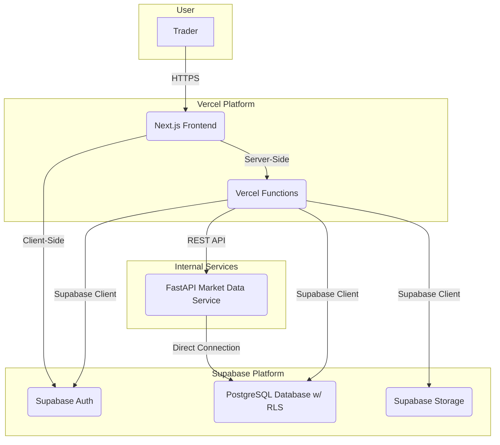

# 2. High Level Architecture

## 2.1. Technical Summary

This architecture utilizes a **Jamstack** approach for the frontend and a **hybrid Backend-as-a-Service (BaaS)** model for the backend. The frontend is a Next.js application featuring Server-Side Rendering (SSR) and Static Site Generation (SSG), hosted on Vercel for optimal performance and global scalability. The backend leverages **Supabase** for its PostgreSQL database, authentication, and file storage, while reserving the capability to integrate **FastAPI** services in the future for specialized tasks. The primary integration point is through the Supabase client library within the Next.js application, enabling secure, direct communication from Next.js's server-side to Supabase, underpinned by Row Level Security (RLS) to ensure data isolation.

## 2.2. Platform and Infrastructure Choice

Based on the PRD requirements and our discussions, the chosen platform is a combination of **Vercel and Supabase**.

*   **Platform:** Vercel (for Frontend) and Supabase (for Backend)
*   **Key Services:**
    *   **Vercel:** Next.js Hosting, Vercel Functions (for lightweight server-side logic), Global CDN.
    *   **Supabase:** PostgreSQL Database, Supabase Auth, Supabase Storage (for chart drawings, images), Row Level Security (RLS).
*   **Deployment Host and Regions:**
    *   **Vercel:** Global (Edge Network).
    *   **Supabase:** To be configured in a region close to the target user base (e.g., `ap-southeast-1` - Singapore).

## 2.3. Repository Structure

A **monorepo** structure managed by **pnpm workspaces** will be used. This approach is well-suited for Next.js applications and allows for efficient code sharing (e.g., TypeScript type definitions).

*   **Structure:** Monorepo
*   **Monorepo Tool:** pnpm workspaces (based on the existing `pnpm-lock.yaml`)
*   **Package Organization:**
    *   `frontend/`: Contains the main Next.js application.
    *   `packages/shared-types`: A shared package for TypeScript definitions used by both the frontend and potentially future backend services.

## 2.4. High Level Architecture Diagram

## 2.5. Architectural Patterns

*   **Jamstack:** Utilizes pre-rendered pages and reusable APIs to deliver higher performance and security.
    *   *Rationale:* Leverages the full strengths of Next.js and Vercel.
*   **Backend as a Service (BaaS):** Leverages Supabase to quickly implement complex backend functionalities.
    *   *Rationale:* Significantly reduces development time for the MVP.
*   **Component-Based UI:** Builds the UI from reusable React components with TypeScript.
    *   *Rationale:* Already established by the Shadcn-ui foundation, ensuring consistency and maintainability.
*   **API Layer Abstraction:** Creates a service layer within the Next.js app to abstract calls to Supabase.
    *   *Rationale:* Facilitates easier migration to future FastAPI services without rewriting logic in multiple places.

---
