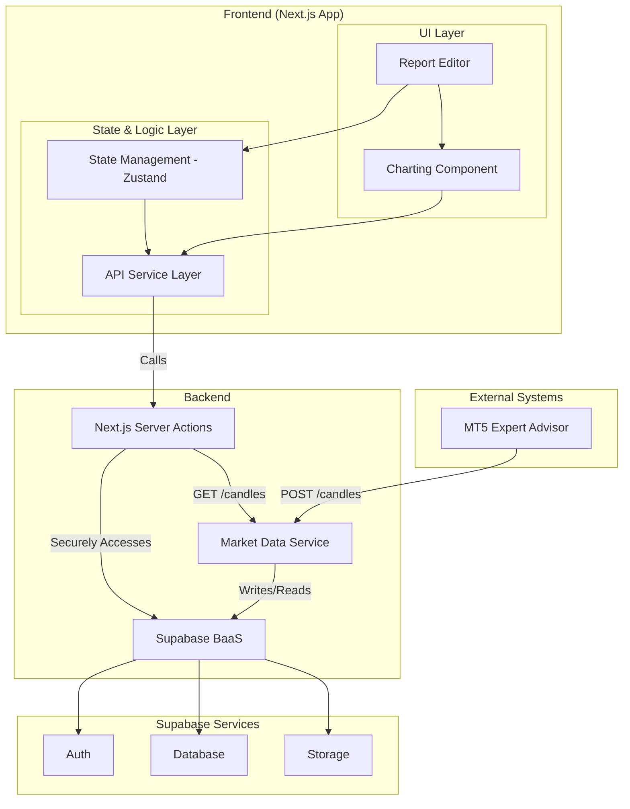

# 6. Components

This section defines the main logical components that make up the system.

## 6.1. Component List

#### Component 1: API Service Layer (Frontend)
*   **Responsibility:** Provide a single, consistent interface for all data operations (CRUD). This layer abstracts the specific implementation (e.g., calling Server Actions to interact with Supabase or the FastAPI service), so UI components don't need to know how data is fetched or sent.
*   **Key Interfaces:** `reportService.ts` (with functions like `getReports`, `createReport`), `marketDataService.ts` (with `getCandles`).
*   **Dependencies:** Next.js Server Actions.
*   **Tech Stack:** TypeScript.

#### Component 2: Report Editor (Frontend)
*   **Responsibility:** Provide the interactive workspace for creating and editing reports. Manages the state of analysis blocks, integrates with the charting library, and orchestrates saving data.
*   **Key Interfaces:** Event handlers like `handleSaveReport`, `handleAddBlock`, `handleDrawingComplete`.
*   **Dependencies:** API Service Layer, Charting Component, State Management (Zustand).
*   **Tech Stack:** React, TypeScript, Zustand, Charting Library.

#### Component 3: Charting Component (Frontend)
*   **Responsibility:** Wrap the **klinecharts** library. Handles rendering candle data fetched from the Market Data Service, providing drawing tools, and exporting/importing the state of drawn objects (`chart_data`).
*   **Key Interfaces:** Props to receive data and callbacks to notify of changes (e.g., `onDrawingsChange`).
*   **Dependencies:** **klinecharts**, API Service Layer.
*   **Tech Stack:** React, TypeScript.

#### Component 4: Supabase Service (BaaS)
*   **Responsibility:** Store, manage, and secure all user-specific application data (reports, assets, etc.). Enforce data integrity and security through constraints and Row Level Security policies.
*   **Key Interfaces:** SQL Interface, Supabase Client API.
*   **Dependencies:** None (it is a foundational service).
*   **Tech Stack:** PostgreSQL, SQL, PL/pgSQL.

#### Component 5: Market Data Service (FastAPI)
*   **Responsibility:** Ingest, store, and serve market data. It receives data from the MT5 EA and provides it to the frontend via a secure GET API.
*   **Key Interfaces:** REST API (`POST /api/v1/candles`, `GET /api/v1/candles`).
*   **Dependencies:** PostgreSQL Database.
*   **Tech Stack:** Python, FastAPI.

#### Component 6: Market Data Ingestor (MT5 EA)
*   **Responsibility:** Capture OHLC candle data from a live MetaTrader 5 terminal. Periodically send this data in batches to the FastAPI service.
*   **Key Interfaces:** Interacts with the MT5 trading platform API and makes HTTP POST requests.
*   **Dependencies:** MetaTrader 5 Terminal.
*   **Tech Stack:** MQL5.

## 6.2. Component Interaction Diagram

This diagram illustrates the relationships between the main logical components.

