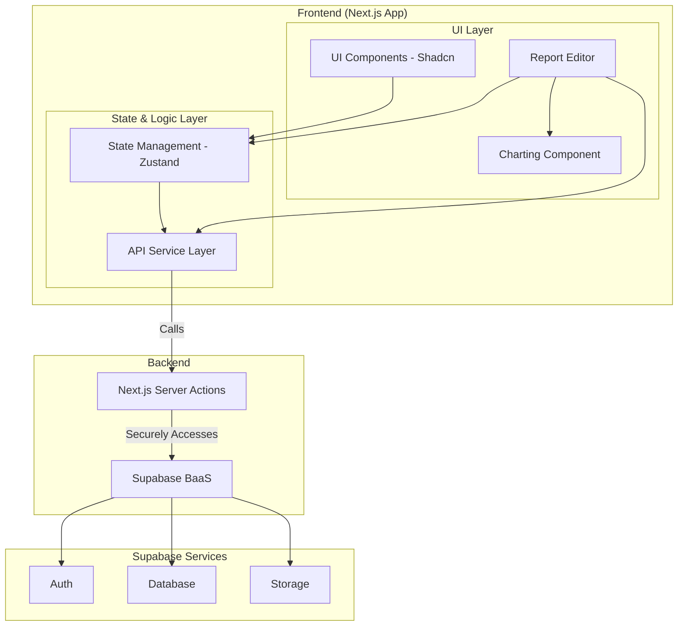

# 6. Components

This section defines the main logical components that make up the system.

## 6.1. Component List

#### Component 1: API Service Layer (Frontend)
*   **Responsibility:** Provide a single, consistent interface for all data operations (CRUD). This layer abstracts the specific implementation (e.g., calling Server Actions), so UI components don't need to know how data is fetched or sent.
*   **Key Interfaces:** `reportService.ts` (with functions like `getReports`, `createReport`), `assetService.ts`, etc.
*   **Dependencies:** Next.js Server Actions.
*   **Tech Stack:** TypeScript.

#### Component 2: Report Editor (Frontend)
*   **Responsibility:** Provide the interactive workspace for creating and editing reports. Manages the state of analysis blocks, integrates with the charting library, and orchestrates saving data for the `Report`, `AnalysisBlock`, and `TradeEntry` models.
*   **Key Interfaces:** Event handlers like `handleSaveReport`, `handleAddBlock`, `handleDrawingComplete`.
*   **Dependencies:** API Service Layer, Charting Component, State Management (Zustand).
*   **Tech Stack:** React, TypeScript, Zustand, Charting Library.

#### Component 3: Charting Component (Frontend)
*   **Responsibility:** Wrap the **klinecharts** library. Handles rendering candle data, providing drawing tools, and exporting/importing the state of drawn objects (`chart_data`).
*   **Key Interfaces:** Props to receive data and callbacks to notify of changes (e.g., `onDrawingsChange`).
*   **Dependencies:** **klinecharts**
*   **Tech Stack:** React, TypeScript.

#### Component 4: Database Service (Backend/Supabase)
*   **Responsibility:** Store, manage, and secure all application data. Enforce data integrity and security through constraints and Row Level Security policies.
*   **Key Interfaces:** SQL Interface, Supabase Client API.
*   **Dependencies:** None (it is the foundation).
*   **Tech Stack:** PostgreSQL, SQL, PL/pgSQL.

## 6.2. Component Diagrams

This diagram illustrates the relationships between the main logical components.

---
