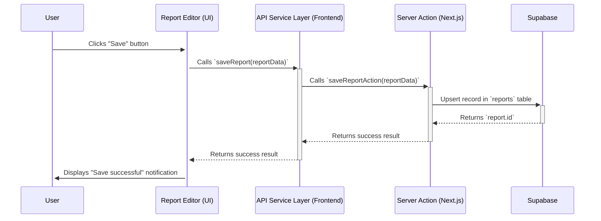

# 8. Core Workflows

This section illustrates key system processes using sequence diagrams to clarify component interactions.

## 8.1. Workflow: Creating a New Analysis Report

This diagram describes the steps from the user clicking "Save" in the report editor to the data being securely stored in Supabase.

---
